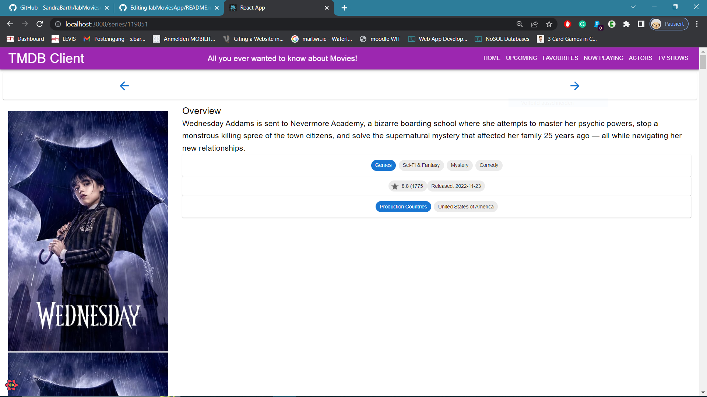
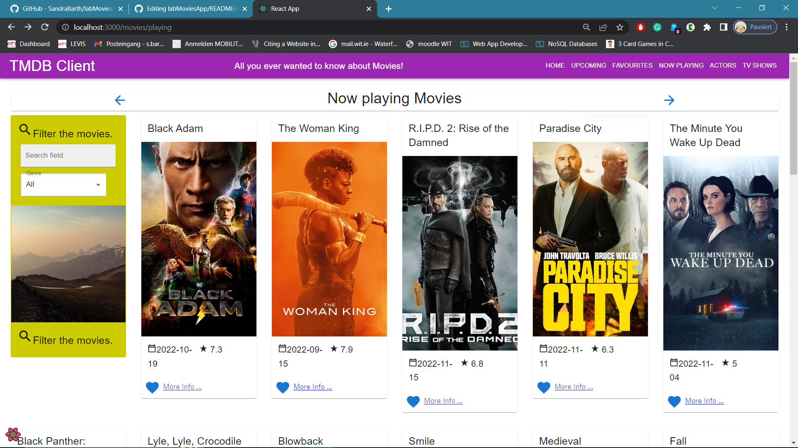
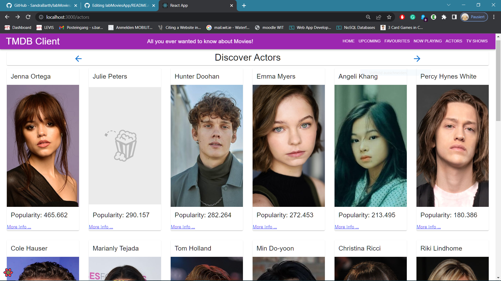
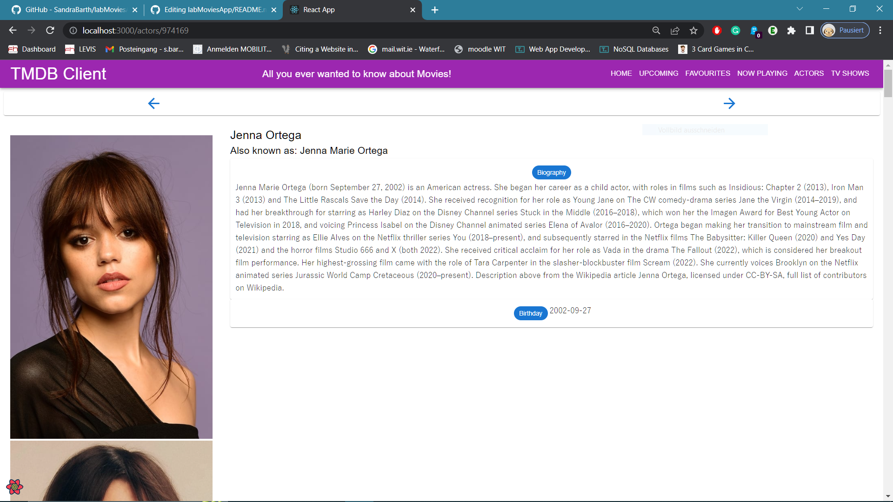

# Web App Dev 2 - Assignment 1 - ReactJS app.

Name: Sandra Barth

## Overview.

### New Pages.
- actor list
- now playing movies list
- tv show list
- actor details
- tv show details 

## Setup requirements.

- npm install
- npm start

## TMDB endpoints.

+ /person/popular - A list of popular actors.
+ /person/{person_id} - Information about a popular actor.
+ /person/{actor_id}/images - Images for an actor.
+ /movie/now_playing - List of now playing movies.
+ /tv/popular - List of popular TV shows
+ /tv/{show_id} - Information about a TV show.
+ /tv/{show_id}/images - Images for a TV show.

## App Design.

### Component catalogue.
Did not integrate Storybook.

### UI Design.

>Shows detailed information on a tv show. 

>Shows list of tv shows. 

>Shows list of now playing movies.
 

>Shows list of popular actors.

>Shows detailed information of an actor. 

### Routing.

+ /actors - displays a list of popular actors.
+ /actors/:id - shows details about a particular actor.
+ /movies/playing - displays a list of now playing movies.
+ /series -  displays a list of popular tv shows.
+ /series/:id -  shows details about a particular tv show.
